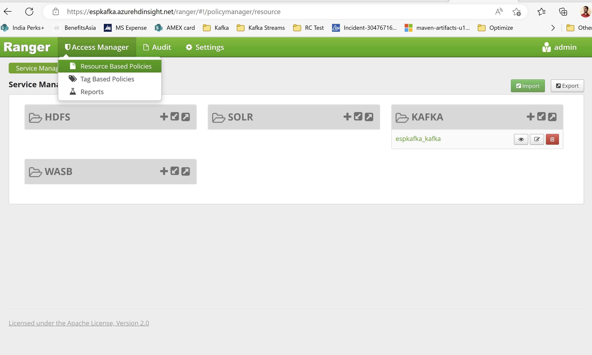
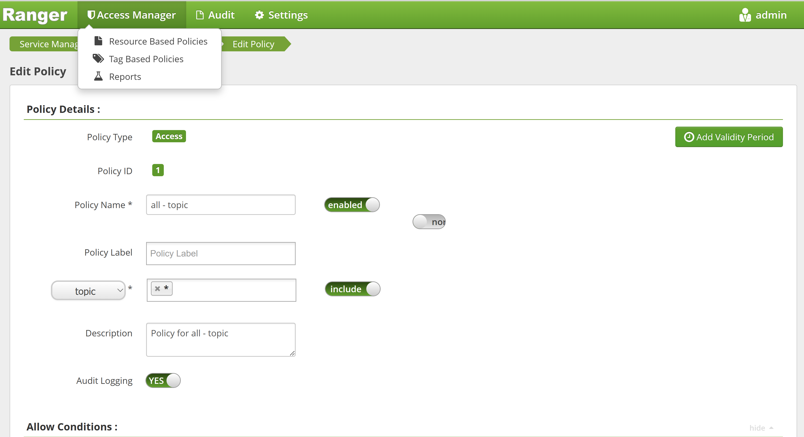
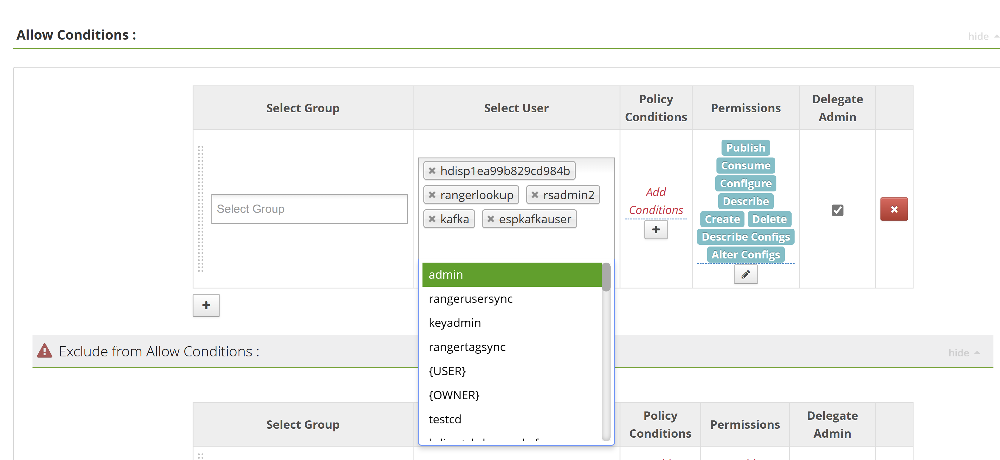

# Java-based example of using the Kafka Consumer, Producer, and Streaming APIs

The examples in this repository demonstrate how to use the Kafka Consumer, Producer, and Streaming APIs with `ESP Kafka including TLS enabled` on HDInsight cluster.

## Prerequisites

* Apache Kafka on HDInsight cluster. To learn how to create the cluster, see [Start with Apache Kafka on HDInsight](apache-kafka-get-started.md).
* [Java Developer Kit (JDK) version 8](https://aka.ms/azure-jdks) or an equivalent, such as OpenJDK.
* [Apache Maven](https://maven.apache.org/download.cgi) properly [installed](https://maven.apache.org/install.html) according to Apache.  Maven is a project build system for Java projects.
* An SSH client like Putty. For more information, see [Connect to HDInsight (Apache Hadoop) using SSH](../hdinsight-hadoop-linux-use-ssh-unix.md).

## Understand the code

If you're using **Enterprise Security Package (ESP) with TLS Encryption** enabled Kafka cluster, you should use the application version located in the `DomainJoined-Producer-Consumer-With-TLS` subdirectory.

The application consists primarily of four files:
* `pom.xml`: This file defines the project dependencies, Java version, and packaging methods.
* `Producer.java`: This file sends random sentences to Kafka using the producer API.
* `Consumer.java`: This file uses the consumer API to read data from Kafka and emit it to STDOUT.
* `AdminClientWrapper.java`: This file uses the admin API to create, describe, and delete Kafka topics.
* `Run.java`: The command-line interface used to run the producer and consumer code.

### Pom.xml

The important things to understand in the `pom.xml` file are:

* Dependencies: This project relies on the Kafka producer and consumer APIs, which are provided by the `kafka-clients` package. The following XML code defines this dependency:

    ```xml
    <!-- Kafka client for producer/consumer operations -->
    <dependency>
            <groupId>org.apache.kafka</groupId>
            <artifactId>kafka-clients</artifactId>
            <version>${kafka.version}</version>
    </dependency>
    ```

  The `${kafka.version}` entry is declared in the `<properties>..</properties>` section of `pom.xml`, and is configured to the Kafka version of the HDInsight cluster.

* Plugins: Maven plugins provide various capabilities. In this project, the following plugins are used:

    * `maven-compiler-plugin`: Used to set the Java version used by the project to 8. This is the version of Java used by HDInsight 4.0.
    * `maven-shade-plugin`: Used to generate an uber jar that contains this application as well as any dependencies. It is also used to set the entry point of the application, so that you can directly run the Jar file without having to specify the main class.

### Producer.java

The producer communicates with the Kafka broker hosts (worker nodes) and sends data to a Kafka topic. The following code snippet is from the [Producer.java](https://github.com/Azure-Samples/hdinsight-kafka-java-get-started/blob/master/DomainJoined-Producer-Consumer/src/main/java/com/microsoft/example/Producer.java) file from the [GitHub repository](https://github.com/Azure-Samples/hdinsight-kafka-java-get-started) and shows how to set the producer properties.

```java
Properties properties = new Properties();
// Set the brokers (bootstrap servers)
properties.setProperty("bootstrap.servers", brokers);
// Set how to serialize key/value pairs
properties.setProperty("key.serializer","org.apache.kafka.common.serialization.StringSerializer");
properties.setProperty("value.serializer","org.apache.kafka.common.serialization.StringSerializer");
// Set the TLS Encryption for Domain Joined TLS Encrypted cluster
properties.setProperty(CommonClientConfigs.SECURITY_PROTOCOL_CONFIG, "SASL_SSL");
properties.setProperty("ssl.mechanism", "GSSAPI");
properties.setProperty("sasl.kerberos.service.name", "kafka");
// Set the SSL Truststore location and password 
properties.setProperty(SslConfigs.SSL_TRUSTSTORE_LOCATION_CONFIG,"/home/sshuser/ssl/kafka.client.truststore.jks");
properties.setProperty(SslConfigs.SSL_TRUSTSTORE_PASSWORD_CONFIG, "MyClientPassword123");
// Set the SSL keystore location and password
properties.setProperty(SslConfigs.SSL_KEYSTORE_LOCATION_CONFIG,"/home/sshuser/ssl/kafka.client.keystore.jks");
properties.setProperty(SslConfigs.SSL_KEYSTORE_PASSWORD_CONFIG, "MyClientPassword123");
// Set the SSL key password
properties.setProperty(SslConfigs.SSL_KEY_PASSWORD_CONFIG, "MyClientPassword123");
KafkaProducer<String, String> producer = new KafkaProducer<>(properties);
```

### Consumer.java

The consumer communicates with the Kafka broker hosts (worker nodes), and reads records in a loop. The following code snippet from the [Consumer.java](https://github.com/Azure-Samples/hdinsight-kafka-java-get-started/blob/master/DomainJoined-Producer-Consumer/src/main/java/com/microsoft/example/Consumer.java) file sets the consumer properties.

```java
KafkaConsumer<String, String> consumer;
// Configure the consumer
Properties properties = new Properties();
// Point it to the brokers
properties.setProperty("bootstrap.servers", brokers);
// Set the consumer group (all consumers must belong to a group).
properties.setProperty("group.id", groupId);
// Set how to serialize key/value pairs
properties.setProperty("key.deserializer","org.apache.kafka.common.serialization.StringDeserializer");
properties.setProperty("value.deserializer","org.apache.kafka.common.serialization.StringDeserializer");
// Set the TLS Encryption for Domain Joined TLS Encrypted cluster
properties.setProperty(CommonClientConfigs.SECURITY_PROTOCOL_CONFIG, "SASL_SSL");
properties.setProperty("ssl.mechanism", "GSSAPI");
properties.setProperty("sasl.kerberos.service.name", "kafka");
// Set the SSL Truststore location and password 
properties.setProperty(SslConfigs.SSL_TRUSTSTORE_LOCATION_CONFIG,"/home/sshuser/ssl/kafka.client.truststore.jks");
properties.setProperty(SslConfigs.SSL_TRUSTSTORE_PASSWORD_CONFIG, "MyClientPassword123");
// Set the SSL keystore location and password
properties.setProperty(SslConfigs.SSL_KEYSTORE_LOCATION_CONFIG,"/home/sshuser/ssl/kafka.client.keystore.jks");
properties.setProperty(SslConfigs.SSL_KEYSTORE_PASSWORD_CONFIG, "MyClientPassword123");
// Set the SSL key password
properties.setProperty(SslConfigs.SSL_KEY_PASSWORD_CONFIG, "MyClientPassword123");
// When a group is first created, it has no offset stored to start reading from. This tells it to start
// with the earliest record in the stream.
properties.setProperty("auto.offset.reset","earliest");
consumer = new KafkaConsumer<>(properties);
```

#### Note:
The important properties added for ESP with TLS Encryption enabled cluster. 
This is critical to add in `AdminClient, Producer and Consumer`.
It is possible that your ESP cluster might have TLS Encryption and Authentication both. Please change the configurations based on 
[Enable TLS Encryption on ESP cluster](https://learn.microsoft.com/en-us/azure/hdinsight/kafka/apache-esp-kafka-ssl-encryption-authentication)
```
// Set the TLS Encryption for Domain Joined TLS Encrypted cluster
properties.setProperty(CommonClientConfigs.SECURITY_PROTOCOL_CONFIG, "SASL_SSL");
properties.setProperty("ssl.mechanism", "GSSAPI");
properties.setProperty("sasl.kerberos.service.name", "kafka");
// Set the SSL Truststore location and password 
properties.setProperty(SslConfigs.SSL_TRUSTSTORE_LOCATION_CONFIG,"/home/sshuser/ssl/kafka.client.truststore.jks");
properties.setProperty(SslConfigs.SSL_TRUSTSTORE_PASSWORD_CONFIG, "MyClientPassword123");
// Set the SSL keystore location and password
properties.setProperty(SslConfigs.SSL_KEYSTORE_LOCATION_CONFIG,"/home/sshuser/ssl/kafka.client.keystore.jks");
properties.setProperty(SslConfigs.SSL_KEYSTORE_PASSWORD_CONFIG, "MyClientPassword123");
// Set the SSL key password
properties.setProperty(SslConfigs.SSL_KEY_PASSWORD_CONFIG, "MyClientPassword123");
```
In this code, the consumer is configured to read from the start of the topic (`auto.offset.reset` is set to `earliest`.)
Above properties can change based on your keystore, truststore location and passwords. Another possible value for `ssl.mechanism` is `PLAIN`

### Run.java

The [Run.java](https://github.com/Azure-Samples/hdinsight-kafka-java-get-started/blob/master/DomainJoined-Producer-Consumer/src/main/java/com/microsoft/example/Run.java) file provides a command-line interface that runs either the producer or consumer code. You must provide the Kafka broker host information as a parameter. You can optionally include a group ID value, which is used by the consumer process. If you create multiple consumer instances using the same group ID, they'll load balance reading from the topic.

## Use Pre-built JAR files

Download the jars from the [Kafka Get Started Azure sample](https://github.com/Azure-Samples/hdinsight-kafka-java-get-started/tree/master/Prebuilt-Jars). If your cluster is **Enterprise Security Package (ESP) with TLS Encryption ** enabled, use kafka-producer-consumer-tls-esp.jar. Use the command below to copy the jars to your cluster.

    ```cmd
    scp kafka-producer-consumer-tls-esp.jar sshuser@CLUSTERNAME-ssh.azurehdinsight.net:kafka-producer-consumer.jar
    ```

## Build the JAR files from code

1. Download and extract the examples from [https://github.com/Azure-Samples/hdinsight-kafka-java-get-started](https://github.com/Azure-Samples/hdinsight-kafka-java-get-started).

2. If you are using **Enterprise Security Package (ESP) with TLS Encryption** enabled Kafka cluster, you should set the location to `DomainJoined-Producer-Consumer` subdirectory. Use the following command to build the application:

    ```cmd
    mvn clean package
    ```

   This command creates a directory named `target`, that contains a file named `kafka-producer-consumer-1.0-SNAPSHOT.jar`. For ESP clusters the file will be `kafka-producer-consumer-esp-1.0-SNAPSHOT.jar`

3. Replace `sshuser` with the SSH user for your cluster, and replace `CLUSTERNAME` with the name of your cluster. Enter the following command to copy the `kafka-producer-consumer-*.jar` file to your HDInsight cluster. When prompted enter the password for the SSH user.

    ```cmd
    scp ./target/kafka-producer-consumer*.jar sshuser@CLUSTERNAME-ssh.azurehdinsight.net:kafka-producer-consumer.jar
    ```

## <a id="run"></a> Run the example
This conversation was marked as resolved by piyushgupta

1. Replace `sshuser` with the SSH user for your cluster, and replace `CLUSTERNAME` with the name of your cluster. Open an SSH connection to the cluster, by entering the following command. If prompted, enter the password for the SSH user account.

    ```cmd
    ssh sshuser@CLUSTERNAME-ssh.azurehdinsight.net
    ```

1. To get the Kafka broker hosts, substitute the values for `<clustername>` and `<password>` in the following command and execute it. Use the same casing for `<clustername>` as shown in the Azure portal. Replace `<password>` with the cluster login password, then execute:

    ```bash
    sudo apt -y install jq
    export clusterName='<clustername>'
    export password='<password>'
    export KAFKABROKERS=$(curl -sS -u admin:$password -G https://$clusterName.azurehdinsight.net/api/v1/clusters/$clusterName/services/KAFKA/components/KAFKA_BROKER | jq -r '["\(.host_components[].HostRoles.host_name):9092"] | join(",")' | cut -d',' -f1,2);
    ```

   > **Note**  
   This command requires Ambari access. If your cluster is behind an NSG, run this command from a machine that can access Ambari.
1. Create Kafka topic, `myTest`, by entering the following command:

    ```bash
    java -jar -Djava.security.auth.login.config=/usr/hdp/current/kafka-broker/config/kafka_client_jaas.conf kafka-producer-consumer.jar create myTest $KAFKABROKERS
    ```

1. To run the producer and write data to the topic, use the following command:

    ```bash
    java -jar -Djava.security.auth.login.config=/usr/hdp/current/kafka-broker/config/kafka_client_jaas.conf kafka-producer-consumer.jar producer myTest $KAFKABROKERS
    ```

1. Once the producer has finished, use the following command to read from the topic:

    ```bash
    java -jar -Djava.security.auth.login.config=/usr/hdp/current/kafka-broker/config/kafka_client_jaas.conf kafka-producer-consumer.jar consumer myTest $KAFKABROKERS
    scp ./target/kafka-producer-consumer*.jar sshuser@CLUSTERNAME-ssh.azurehdinsight.net:kafka-producer-consumer.jar
    ```

   The records read, along with a count of records, is displayed.

1. Use __Ctrl + C__ to exit the consumer.

### Run the Example with another User (espkafkauser)

1. To get the Kafka broker hosts, substitute the values for `<clustername>` and `<password>` in the following command and execute it. Use the same casing for `<clustername>` as shown in the Azure portal. Replace `<password>` with the cluster login password, then execute:

    ```bash
      sudo apt -y install jq
      export clusterName='<clustername>'
      export password='<password>'
      export KAFKABROKERS=$(curl -sS -u admin:$password -G https://$clusterName.azurehdinsight.net/api/v1/clusters/$clusterName/services/KAFKA/components/KAFKA_BROKER | jq -r '["\(.host_components[].HostRoles.host_name):9092"] | join(",")' | cut -d',' -f1,2);
    ```
2. Create the keytab file for espkafkauser with below steps
   ```bash
    ktutil
    ktutil: addent -password -p espkafkauser@TEST.COM -k 1 -e RC4-HMAC
    Password for espkafkauser@TEST.COM:
    ktutil: wkt espkafkauser.keytab
    ktutil: q
   ```

**NOTE:-**
1. espkafkauser should be part of your domain group and add it in RangerUI to give CRUD operations privileges.
2. Keep this domain name (TEST.COM) in capital only. Otherwise, kerberos will throw errors at the time of CRUD operations.

You will be having an espkafkauser.keytab file in local directory. Now create an espkafkauser_jaas.conf jaas config file with data given below

```
KafkaClient {
  com.sun.security.auth.module.Krb5LoginModule required
  useKeyTab=true
  storeKey=true
  keyTab="/home/sshuser/espkafkauser.keytab"
  useTicketCache=false
  serviceName="kafka"
  principal="espkafkauser@TEST.COM";
};
```
### Steps to add espkafkauser on RangerUI
1. Go to overview page of cluster and use Ambari UI URL to open ranger. Enter the Ambari UI credentials and it should work.


   ```
   Generic 
    https://<cluster-endpoint>/ranger
   
   Example 
    https://espkafka.azurehdinsight.net/ranger
   ```

2. If everything is correct then you will be able to see ranger dashboard. Now click on Kafka link.




3. Now we can see policy page where some users like kafka have access to do CRUD operation on alltopics.


4. Now edit the alltopic policy and add espkafkauser in selectuser from dropdown. Click on save policy after changes






5. If we are not able to see our user in dropdown then that mean that user is not available in AAD domain.

6. Now Execute CRUD operations in head node for verification

```bash
# Sample command
java -jar -Djava.security.auth.login.config=JAAS_CONFIG_FILE_PATH PRODUCER_CONSUMER_ESP_JAR_PATH create $TOPICNAME $KAFKABROKER

# Create
java -jar -Djava.security.auth.login.config=user_jaas.conf kafka-producer-consumer-tls-esp.jar create $TOPICNAME $KAFKABROKERS

# Describe
java -jar -Djava.security.auth.login.config=user_jaas.conf kafka-producer-consumer-tls-esp.jar describe $TOPICNAME $KAFKABROKERS

#Produce
java -jar -Djava.security.auth.login.config=user_jaas.conf kafka-producer-consumer-tls-esp.jar producer $TOPICNAME $KAFKABROKERS

#Consume
java -jar -Djava.security.auth.login.config=user_jaas.conf kafka-producer-consumer-tls-esp.jar consumer $TOPICNAME $KAFKABROKERS

#Delete
java -jar -Djava.security.auth.login.config=user_jaas.conf kafka-producer-consumer-tls-esp.jar delete $TOPICNAME $KAFKABROKERS
```


### Multiple consumers

Kafka consumers use a consumer group when reading records. Using the same group with multiple consumers results in load balanced reads from a topic. Each consumer in the group receives a portion of the records.

The consumer application accepts a parameter that is used as the group ID. For example, the following command starts a consumer using a group ID of `myGroup`:

```bash
java -jar -Djava.security.auth.login.config=user_jaas.conf kafka-producer-consumer-tls-esp.jar consumer myTest $KAFKABROKERS myGroup
```

Use __Ctrl + C__ to exit the consumer.

To see this process in action, use the following command:

With Kafka as user
```bash
tmux new-session 'java -jar -Djava.security.auth.login.config=/usr/hdp/current/kafka-broker/config/kafka_client_jaas.conf kafka-producer-consumer-tls-esp.jar consumer myTest $KAFKABROKERS myGroup' \
\; split-window -h 'java -jar -Djava.security.auth.login.config=/usr/hdp/current/kafka-broker/config/kafka_client_jaas.conf kafka-producer-consumer-tls-esp.jar consumer myTest $KAFKABROKERS myGroup' \
\; attach
```

With custom user
```bash
tmux new-session 'java -jar -Djava.security.auth.login.config=user_jaas.conf kafka-producer-consumer-tls-esp.jar consumer myTest $KAFKABROKERS myGroup' \
\; split-window -h 'java -jar -Djava.security.auth.login.config=user_jaas.conf kafka-producer-consumer-tls-esp.jar consumer myTest $KAFKABROKERS myGroup' \
\; attach
```

This command uses `tmux` to split the terminal into two columns. A consumer is started in each column, with the same group ID value. Once the consumers finish reading, notice that each read only a portion of the records. Use __Ctrl + C__ twice to exit `tmux`.

Consumption by clients within the same group is handled through the partitions for the topic. In this code sample, the `test` topic created earlier has eight partitions. If you start eight consumers, each consumer reads records from a single partition for the topic.

> [!IMPORTANT]  
> There cannot be more consumer instances in a consumer group than partitions. In this example, one consumer group can contain up to eight consumers since that is the number of partitions in the topic. Or you can have multiple consumer groups, each with no more than eight consumers.

Records stored in Kafka are stored in the order they're received within a partition. To achieve in-ordered delivery for records *within a partition*, create a consumer group where the number of consumer instances matches the number of partitions. To achieve in-ordered delivery for records *within the topic*, create a consumer group with only one consumer instance.

## Common Issues faced

1. Topic creation fails


    If your cluster is Enterprise Security Pack enabled, use the [pre-built JAR files for producer and consumer](https://github.com/Azure-Samples/hdinsight-kafka-java-get-started/blob/master/Prebuilt-Jars/kafka-producer-consumer-tls-esp.jar).


The ESP with TLS Encryption jar can be built from the code in the [`DomainJoined-Producer-Consumer-With-TLS` subdirectory](https://github.com/Azure-Samples/hdinsight-kafka-java-get-started/tree/master/DomainJoined-Producer-Consumer-With-TLS).


1. Facing issue with ESP enabled clusters

If produce and consume operations fail, and you are using an ESP enabled cluster, check that the user `kafka` is present in all Ranger policies. If it is not present, add it to all Ranger policies.      

